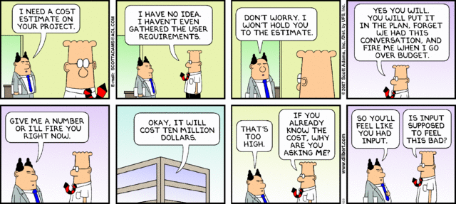

_I want to emphasize clearly, up-front, that this a very opinionated article on a very difficult subject. I also would like to emphasize that I'm not just making this stuff up...all of this is based on my personal experiences over the course of my ~16 year career as a software developer. I've been there and done that..._

_**CREDITS:** I'd like to thank [Jordan Kasper](https://twitter.com/jakerella) for his review and feedback on this article._

TLDR: Software estimation is _hard._ Software is _complicated._ Requirements are _almost always_ incomplete and/or inaccurate. Requirements _almost always_ change. Approach your software project with realistic expectations. Spend time getting the requirements for your project right, up front. Involve your developer/team in the requirements gathering and analysis task.

---

### Conundrum

> a confusing or difficult problem -- <cite>[Merriam-Webster Dictionary](http://www.merriam-webster.com/dictionary/conundrum)</cite>

There are two things that have been at odds for virtually the entirety of my software development career (over 15 years now):

1. I don't recall having _**ever**_ delivered an estimate for a project that wasn't questioned or stated as being "too high."
2. I cannot recall a _**single**_ project that was completed to the originally requested specs within the schedule that was requested by management and/or the customer.

There are a number of reasons why I believe these two things are too often at odds with each other...

### Software estimation is _hard_

There are _so many things_ that factor in to a software project estimate...its truly and honestly nearly impossible to get it right. Consider things like:

* the size of the requested software
* the requested schedule for delivery of the software
* budget...which can have an impact on...
* the desired/targeted technology stack, which can, in turn, impact...
* the experience that the developer/team that will be doing the work has with that technology stack, which has nothing at all to do with...
* the experience level in general of the developer/team that will be doing the work, and their ability to solve the problems that will be presented by the requested software, which can be significantly impacted by...
* the type of business and the specific business rules and considerations the software will be supporting (i.e. health care, insurance, sales, technical support, document processing, finance, business-to-business information exchange, security, etc, etc, etc...), which reminds me of...
* the security requirements of the requested software, which can be impacted by...
* the laws relative to the data the requested software will be required to process and handle (Privacy Act, HIPAA, etc, etc)
* the general computer experience level of the users that will be using the software
* the device(s) the software will be used on
* ...

I mean really, I could on and on all day long...this list is practically never-ending. There are potentially _hundreds_ of different variables that will need to be considered in the course of estimating any and every software project that's ever done...and the fact of the matter is...a huge portion of them will just flat out not be considered when the estimate is being made. This is precisely why _**software estimation is hard**_.

### Software is _complicated_

As you might be able to deduce from imagining the process of trying to actually write some software based on all of the above considerations, this is almost always a pretty daunting task. On top of all of that though, _good_ software developers will now start doing their level best to apply good, solid, software development practices to the code that they write. They will be trying to generate code that:

* is readable, modular, maintainable and testable
* does not mix concerns
* does not repeat itself
* generally trying to do the right thing for the long-term of the project

In the end, this results in _lots_ of moving parts that end up having to work together successfully for the product to work as expected. The task of designing and building those parts so they know how to talk to and work together is _not_ easy, and it takes time. It doesn't just happen overnight...a lot of time and work goes into it. Be patient, and let your developer/team do it right. Trust me...getting it right the first time will ultimately save everyone a LOT of pain and money in the long run.

### Requirements _almost always_ su...er...they're almost always wrong or incomplete

Woops, almost slipped there. It really is true though...requirements are really hard to get right, and in my experience, they are nearly _always_ incomplete and inaccurate (i.e. they don't accurately describe what the customer actually wants). Ultimately there are two things that play together into this problem:

1. The people that are writing the requirements in most cases don't have a solid enough understanding of the technical capabilities of the target platform to take advantage of them, and end up writing up the requirements such that they end up being much more difficult to implement that they should be, and
2. The developers who will _actually be doing the work_ are _rarely_ involved in requirements gathering or consulted in the design of the proposed solution, so their technical knowledge of the target platform and its capabilities are not taken advantage of.

As a result of this, the resulting "requirements" typically (yes, typically...I'm generalizing a bit here, this is certainly not _always_ the case, but it happens often in my experience) end up taking on one of two opposite extremes:

1. Either its some ginormous mountain of text (a document...usually either a Word or a PDF document) comprised of user stories and/or functional requirements with little or no visual indication of what the user interface should look like or how it should behave...
2. Or, its the exact opposite, where its just a collection of wireframes or Photoshop documents that provide a visual indication of what the user interface should _look like_, but little-to-no corresponding documentation describing how the various elements of the UI should behave when the user interacts with them.

Of course there are other more minor variations, differences, nuances, what-have-you, but in general, these are the two primary, major issues I've most often experienced. The bottom line though, is that far too seldom is there a reasonable middle-ground where both of these kinds of artifacts are provides as requirements, and the result is a lot of thrashing involving both sides attempting to resolve the deficiencies in the requirements, which ends up costing valuable time and money.

### Requirements _almost always_ change

Remember that laundry-list of stuff I talked about in the first section when I was talking about all of the things to consider when estimating a software project? Remember when I mentioned how many things _don't_ get considered in the estimate. Well, at some point, it all gets thought of...because its all important on some level. So what happens when somebody finally realizes, _"well what about &lt;that thing that everyone forgot about during project planning&gt;?"_ What happens? The requirements get changed...thats what happens.

_Happens. Every. Time._

So what's the answer? How is this mitigated? This _used to be_ mitigated by using a long, drawn-out "waterfall" approach to software project management, where months and months, sometimes years, are spent in requirements gathering and analysis, documentation, contractual agreements guaranteeing that the agreed-upon requirements won't change, and if/when they do it will cost the customer through-the-nose to do so. Yeah, that didn't work.

More recently, we have attempted to mitigate this problem with an "agile" approach that welcomes change as a recognized part of the software development process. This is fine, except for the fact that change is almost never dealt with the way it should be...

### An _estimate_ is not a _commitment_

To my last point there, in an agile process, when a requirement change occurs, in most cases, this event should result in some kind of domino effect. A change in requirements is almost always going to impact one of two things: either the scope of the project or the schedule of the project...or both. Far too often, in my experience, this scope shuffle doesn't happen as it should. That task gets overlooked or forgotten in favor of just "moving on and getting things done." This mistake nearly always results in future strain when deadlines get threatened and fingers start getting pointed.

Part of the problem here is the fact that in too many cases, either management, or the customer...or often both...makes the mistake (reminder: this is opinion people) of translating an _estimate_ into a _commitment_. While there is unquestionably a relationship between the two, they are undoubtedly _not_ one-and-the-same.

Besides the obvious things like scope creep (requirements change), other things that tend to not be taken into consideration when a developer/team says "we think this should take about six months" and the response is something along the lines of "oh great, then that means you could have it done by April then, right?" are things like...well, for one, _**life**_...vacations, illness, attrition (_I'm sick of working under these conditions, I'm outta here_), etc, etc. There's a LOT more to consider than _just_ the estimate that was provided.

Despite that, too often, management or the customer ends up translating the given estimate into a commitment and ultimately a delivery date, and they become _so fixated on that date_ that they become unwilling to ever accept the possibility of _not getting what they want when they want it._ The unfortunate result of this is almost always friction.

### So where do we go from here?

Sounds like a lot of problems, doesn't it? Well, it is. It really is. I'm not just saying that to be dramatic. I love my job. Creating software that makes peoples lives easier is something I've loved doing for a long time. Despite how much I typically like my job, there's one unavoidable aspect of doing it for a living that I've come to REALLY dislike: estimation.

Seriously, I hate it. NOBODY likes it. Its absolutely the worst part of the job all around. I don't like it. The people I give estimates _to_ don't like it. Its just a sad time all around. Its a real bummer.

So how can we change that? Great question...and as much as I hate to say it, one that I don't really have a whole lot of great answers to. I mean, don't get me wrong...I have some _ideas_, but they've not been proven out, so I can't guarantee they'll alleviate all of our pain...plus, I'm _certain_ there's stuff I'm forgetting about too.

#### Start with realistic expectations

Seriously people, lets all be real. No, you can't have a fully-functional, end-to-end eCommerce capable web site to sell your wife's quilts through knocked out in a week...and you _definitely_ can't have it for $50. Just because your 14 year old nephew was able to whip together a blog for himself in his copious free time at school does NOT mean this stuff is easy to do. Its hard...and it takes time...and the people that you hire to do this for you deserve to be compensated for their time and energy.

Also, expect it to cost money. Not even considering the time involved, there are a _lot_ of tools and resources needed to build all kinds of software, even when open source software is used to do it, there are still costs involved. All of that stuff has to be configured and bolted together to ultimately solve an important problem for you. If its not worth the cost, is it really worth pursuing the project?

There are three primary measurable characteristics of a software development project: cost, efficiency and quality. The customer gets to choose two of those three...you can't have them all. If you want it fast, and want high-quality, its going to cost a lot. If you want it cheap and want high-quality, don't expect to see it anytime soon. You want it fast and cheap, expect to find a lot of bugs in it. Make sense?

#### Take the time to define good requirements

Honestly, it really doesn't matter _what_ project management methodology you use for your project...this step _cannot_ be overlooked. It will save everyone involved a LOT of time, money and heartache in the long run. Be patient, get them as close to right as possible the first time through. If its important enough to do, its important enough to do right. This doesn't necessarily mean they have to be _exhaustive_ or that you have to spend months or years defining them...it just means that everyone should put their best foot forward in covering as many of the bases as possible before getting started.

#### Let your developer/team _help you_ develop your requirements

A _lot of them_ (OK, yeah..._us_) out there are _actually_ pretty smart, believe it or not. And, they have the distinct advantage of understanding technology and the capabilities of the platform they'll be building your software with...they can _almost always_ help with getting the requirements right.

If you _try_ to involve your developer/team in this process and they try to tell you that they don't have time, or should not be involved in that part of the process, let that be a red flag to you. If they don't understand the process well enough to know that they _should_ be involved in it, then I would argue that they're not good enough to get the job done for you very well at all.

### Communication and trust

Ultimately these are the two main things that software development and estimation is based on. If communication is not effective and trust between all parties is not established, then things are bound to just not go well. Take the time you need to select the right developer/team/organization to handle your software project development for you. Get to know them. Keep the lines of communication with them open at all times. Develop a trust with them. Of course, I can't _guarantee_ that this will ensure the success of your project...like I said, software development _is hard_, and it doesn't always work out the way we want it to. But these things _should_ help at least make the experience better for everyone involved...most importantly, you, the customer.

I truly do hope this is in some way helpful to someone.
